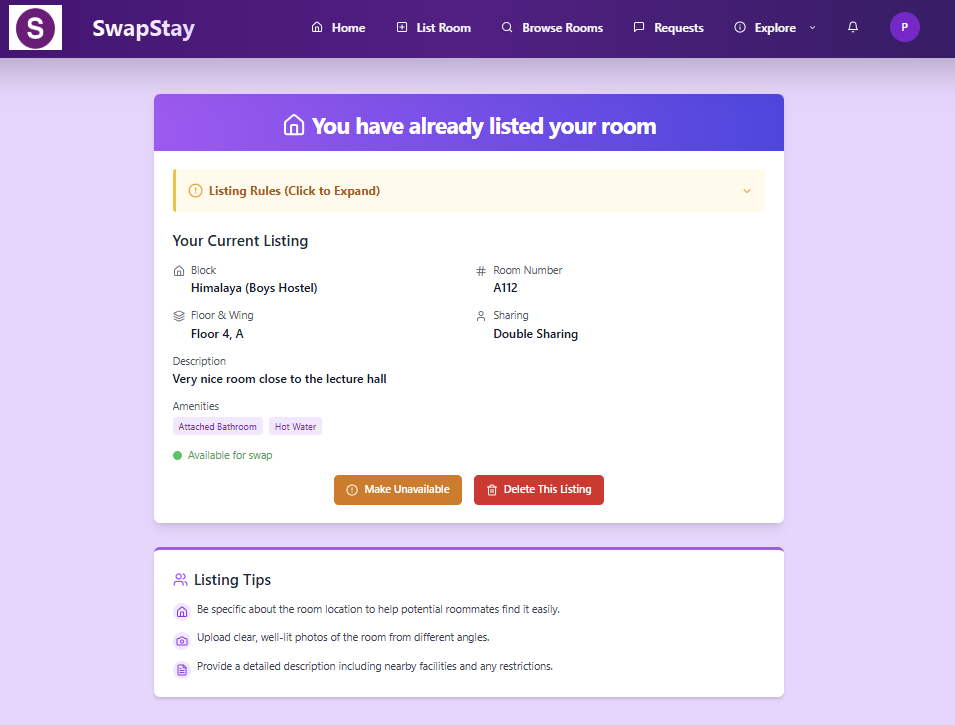
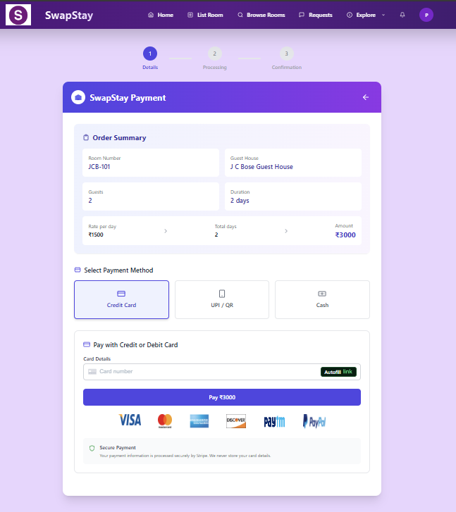
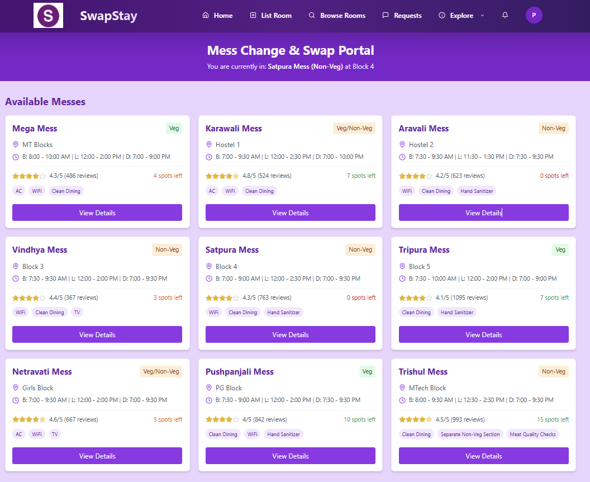
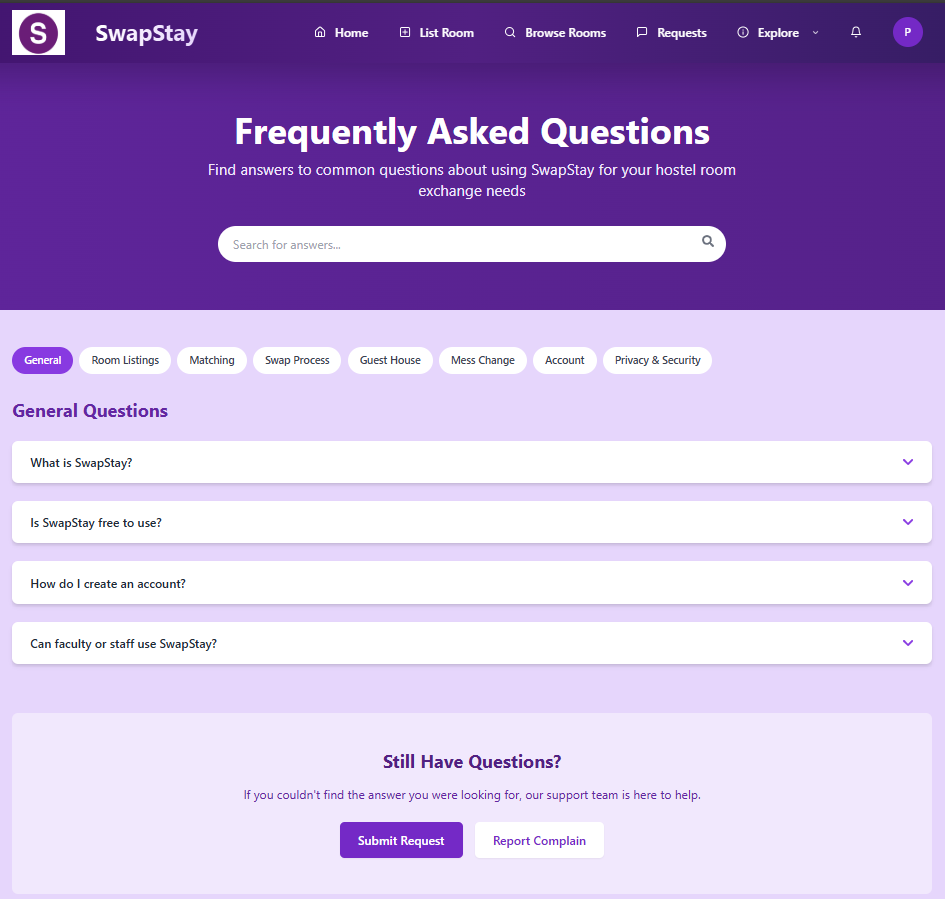
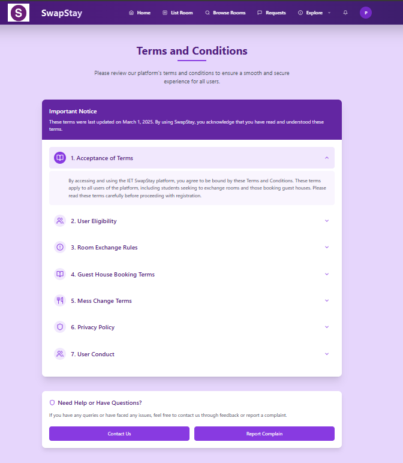

# SwapStay - Streamlined Room Swapping & Campus Booking

<p align="center">
  
</p>

**SwapStay** is a comprehensive web platform designed specifically for students in hostels and residential campuses, enabling seamless **room swapping**, **mess booking**, and **guest house reservations**. Our platform simplifies campus living with intelligent matching, real-time communication, secure transactions, and automated administrative workflows.

---

## 🌐 Live Demo

> 🔗 **Live URL:** Coming Soon  
> 🧪 **Demo Credentials:** Available on request  
> 📽️ **Demo Video:** [Watch Here](#) _(Coming Soon)_

---

## 📸 Preview  
>  If any uploaded image appears scaled or unclear, please click on the image to view it in full resolution for better clarity.

---

<details>
  <summary><strong>🔐 Authentication</strong></summary>

  <table align="center">
    <tr>
      <td></td>
      <td></td>
    </tr>
    <tr>
      <td></td>
      <td></td>
    </tr>
    <tr>
      <td></td>
      <td></td>
    </tr>
  </table>
  <p align="center"><em>Login, Sign Up, Activate, Deactivate Accounts, Reset Password</em></p>
</details>

---

<details>
  <summary><strong>🏠 Home & About Us</strong></summary>

  <table align="center">
    <tr>
      <td></td>
      <td></td>
    </tr>
    <tr>
      <td></td>
      <td></td>
    </tr>
    <tr>
      <td></td>
      <td></td>
    </tr>
    <tr>
      <td></td>
      <td></td>
    </tr>
  </table>
  <p align="center"><em>Homepage, Problem-Solution, Features, and Benefits</em></p>
</details>

---

<details>
  <summary><strong>🛏️ Room Listing</strong></summary>

  <table align="center">
    <tr>
      <td></td>
      <td></td>
    </tr>
  </table>
  <p align="center"><em>Add and manage your own rooms</em></p>
</details>

---

<details>
  <summary><strong>🔍 Browse Room</strong></summary>

  <table align="center">
    <tr>
      <td></td>
      <td></td>
    </tr>
    <tr>
      <td></td>
      <td></td>
    </tr>
  </table>
  <p align="center"><em>Explore available rooms and view detailed info</em></p>
</details>

---

<details>
  <summary><strong>🔁 Request Room</strong></summary>

  <table align="center">
    <tr>
      <td></td>
      <td></td>
    </tr>
    <tr>
      <td></td>
      <td></td>
    </tr>
  </table>
  <p align="center"><em>Send swap requests and manage interactions</em></p>
</details>

---

<details>
  <summary><strong>💬 Real time communication & notification</strong></summary>

  <table align="center">
    <tr>
      <td></td>
      <td></td>
    </tr>
  </table>
  <p align="center"><em>Real-time chat and notifications</em></p>
</details>

---

<details>
  <summary><strong>🏨 Guest House Booking</strong></summary>

  <table align="center">
    <tr>
      <td></td>
      <td></td>
    </tr>
    <tr>
      <td></td>
      <td></td>
    </tr>
    <tr>
      <td></td>
      <td></td>
    </tr>
  </table>
  <p align="center"><em>Book and manage guest house reservations</em></p>
</details>

---

<details>
  <summary><strong>🍽️ Mess Change Booking</strong></summary>

  <table align="center">
    <tr>
      <td></td>
      <td></td>
    </tr>
    <tr>
      <td></td>
      <td></td>
    </tr>
  </table>
  <p align="center"><em>Book mess meals and submit feedback</em></p>
</details>

---

<details>
  <summary><strong>📄 Other Pages</strong></summary>

  <table align="center">
    <tr>
      <td></td>
      <td></td>
    </tr>
    <tr>
      <td></td>
      <td></td>
    </tr>
    <tr>
      <td></td>
      <td></td>
    </tr>
    <tr>
      <td></td>
      <td></td>
    </tr>
  </table>
  <p align="center"><em>Feedback, Settings, Report Complaint & Track Status, FAQ, Terms</em></p>
</details>

---

<details>
  <summary><strong>🔚 Footer</strong></summary>

  <table align="center">
    <tr>
      <td></td>
      <td></td>
    </tr>
  </table>
  <p align="center"><em>Footer section (Light & Dark mode)</em></p>
</details>

---

## ✨ Key Features

### 🔐 **Advanced Authentication & Security**

- **JWT-based Authentication** with comprehensive student profile management
- **Academic Integration:** Roll number, department, year, gender validation
- **Multi-layer Verification:** OTP-based mobile verification via Firebase
- **Secure Password Management:** Mailtrap integration for password reset
- **Session Security:** Cookie-based session handling with bcrypt password hashing
- **Account Management:** Secure account deactivation/reactivation with password confirmation

### 🏠 **Intelligent Room Swapping System**

- **Comprehensive Room Listing:**

  - Detailed room specifications (block, wing, floor, room number)
  - Multi-image upload (up to 5 high-quality images)
  - Rich amenities description and room features
  - Real-time availability status management

- **Advanced Room Discovery:**

  - **Smart Filtering:** Gender-based (boys/girls/mega tower), block, wing, floor, hostel
  - **Intelligent Search:** Quick room and user search functionality
  - **Visual Cards:** Room images, user profiles, and key details at a glance
  - **Detailed Modal Views:** Swipeable image galleries, comprehensive room details, amenities, and occupant information

- **Sophisticated Request Management:**
  - **Priority-based Requests:** High, moderate, low priority selection
  - **Duplicate Prevention:** Smart system prevents multiple requests between same users
  - **Request Reasoning:** Mandatory swap reason for transparency
  - **Status Tracking:** Real-time request status updates (pending, accepted, rejected, cancelled)
  - **Bidirectional Visibility:** Both parties can track request progress

### 💬 **Real-time Communication System**

- **WhatsApp-style Interface:** Familiar, intuitive messaging experience
- **WebSocket Integration:** Instant message delivery and real-time updates
- **Smart Chat Organization:**
  - Contact grouping with unread message badges
  - Green highlighting for new messages
  - Search functionality across all conversations
  - Chronological message sorting with "unread divider"
- **Context-aware Messaging:** Integrated request details in chat headers
- **Message Status Tracking:** Read receipts and delivery confirmations

### 📊 **Comprehensive Request Dashboard**

- **Multi-view Request Management:**
  - Incoming requests with detailed user profiles
  - Outgoing requests with status tracking
  - Historical request archive
- **Advanced Filtering & Sorting:**
  - Status-based filters (pending, accepted, rejected, cancelled)
  - Priority-based sorting (high, moderate, low)
  - Date-based chronological sorting
- **Side-by-side Room Comparison:** Visual comparison tool for informed decision-making
- **Action Management:** Accept, reject, cancel with mandatory reason capture
- **Receipt Generation:** Automated PDF generation with digital signatures for hostel administration

### 🍽️ **Complete Mess Management System**

- **Mess Discovery & Registration:**

  - Comprehensive mess profiles with ratings, reviews, and menus
  - Tag-based categorization (veg/non-veg, Jain, North/South Indian)
  - Real-time vacancy tracking and availability
  - Detailed amenities and timing information

- **Mess Swapping Workflow:**
  - Reason-based swap requests with predefined categories
  - Subject selection (proximity, friends, food quality, etc.)
  - Instant mess transfer upon approval
  - Downloadable swap receipts for administration
  - Real-time vacancy updates across the platform

### 🏨 **Full-featured Guest House Booking**

- **Comprehensive Guest House Management:**

  - Multiple guest house options with detailed profiles
  - Image galleries and location information
  - Amenity-based filtering and room selection

- **Advanced Booking System:**

  - **Date-based Availability:** Real-time check-in/check-out date filtering
  - **Dynamic Guest Management:** Flexible guest information capture
  - **Room Filtering:** Beds, price range, amenities, descriptions
  - **Real-time Price Calculation:** Dynamic pricing based on duration and room type

- **Secure Payment Integration:**
  - **Stripe Integration:** Secure, PCI-compliant payment processing
  - **Multiple Payment Methods:** Card, UPI, cash options
  - **Payment Status Tracking:** Real-time payment confirmation
  - **Booking Management:** Active, future, and historical booking views
  - **Cancellation System:** Flexible cancellation for current and future bookings

### 🔔 **Smart Notification System**

- **Real-time Updates:** Instant notifications for all platform activities
- **Badge Counters:** Visual indicators for new requests and messages
- **Notification Center:** Centralized notification management with mark-as-read functionality
- **Status Updates:** Real-time request status change notifications
- **Toast Confirmations:** User-friendly confirmation system preventing accidental actions

### ⚙️ **Personalized User Experience**

- **Profile Management:**

  - Real-time profile image upload and management
  - Comprehensive user detail editing
  - Room listing management and settings

- **Theme Customization:**

  - Light, Dark, and System theme options
  - Consistent theming across all platform components
  - User preference persistence

- **Room Management:**
  - Single room listing per user with edit capabilities
  - Availability toggle (available/unavailable for swapping)
  - Listing cancellation with confirmation

### 🛠️ **Additional Platform Features**

- **Feedback & Complaint System:**

  - Comprehensive complaint filing with image proof upload
  - Priority-based complaint categorization
  - Status tracking and resolution history
  - Filtering and sorting capabilities

- **Knowledge Base:**

  - **FAQ System:** Searchable, categorized frequently asked questions
  - **Section-based Organization:** Guest house, room swap, privacy, mess categories
  - **Dynamic Search:** Real-time question filtering

- **Administrative Tools:**
  - **PDF Generation:** Automated receipt creation for all transactions
  - **Access Control:** Role-based access with secure route protection
  - **Session Management:** Secure cookie-based session handling

---

## 🛠️ Technology Stack

### **Frontend Architecture**

- **React.js** - Modern component-based UI framework
- **Tailwind CSS** - Responsive web design
- **Firebase SDK** - Authentication and OTP services
- **WebSocket Client** - Real-time communication
- **Stripe.js** - Secure payment processing
- **Responsive Design** - Mobile-first approach with cross-device compatibility

### **Backend Infrastructure**

- **Node.js + Express.js** - High-performance server architecture
- **MongoDB + Mongoose** - NoSQL database with ODM for scalability
- **JWT Authentication** - Stateless, secure token-based authentication
- **bcrypt** - Military-grade password hashing
- **Firebase Admin SDK** - Server-side Firebase integration
- **Mailtrap** - Reliable email service for password reset
- **WebSocket Server** - Real-time bidirectional communication

### **Security & Performance**

- **Cookie-based Session Management** - Secure session handling
- **Password Encryption** - bcrypt with salt rounds
- **Input Validation** - Comprehensive server-side validation
- **Rate Limiting** - API protection against abuse
- **CORS Configuration** - Secure cross-origin requests

---

## 📁 Project Structure

```
SwapStay/
├── frontend/                     # Frontend React Application
│   ├── src/
│   │   ├── components/         # Reusable UI components
│   │   ├── pages/             # Main application pages
│   │   ├── styles/            # Module CSS stylesheets
│   │   ├── utils/             # Helper functions and utilities
│   │   ├── context/           # React context providers
│   │   └── hooks/             # Custom React hooks
│   ├── public/                # Static assets and index.html
│   └── package.json           # Frontend dependencies
├── backend/                    # Backend Express Application
│   ├── controllers/           # Request handlers and business logic
│   ├── models/               # MongoDB schemas and models
│   ├── routes/               # API route definitions
│   ├── middleware/           # Authentication and validation middleware
│   ├── utils/                # Server utilities and helpers
│   └── package.json          # Backend dependencies
├── screenshots/              # Application screenshots for README
├── .env.example             # Environment variables template
├── .gitignore              # Git ignore rules
└── README.md               # Comprehensive documentation
```

---

## 🚀 Installation & Setup

### **Prerequisites**

- Node.js (v14.0.0 or higher)
- MongoDB (v4.4 or higher)
- Firebase Project with Authentication enabled
- Stripe Account for payment processing
- Mailtrap Account for email services

### **Environment Configuration**

Create `.env` files in both client and server directories:

**Server `.env`:**

```env
# Database
MONGODB_URI=mongodb://localhost:27017/swapstay
DB_NAME=swapstay

# Authentication
JWT_SECRET=your_super_secure_jwt_secret_key_here
JWT_EXPIRES_IN=7d
BCRYPT_SALT_ROUNDS=12

# Firebase Configuration
FIREBASE_PROJECT_ID=your_firebase_project_id
FIREBASE_PRIVATE_KEY=your_firebase_private_key
FIREBASE_CLIENT_EMAIL=your_firebase_client_email

# Email Services
MAILTRAP_HOST=smtp.mailtrap.io
MAILTRAP_PORT=2525
MAILTRAP_USER=your_mailtrap_username
MAILTRAP_PASS=your_mailtrap_password

# Server Configuration
PORT=5000
NODE_ENV=development
CORS_ORIGIN=http://localhost:3000
```

**Client `.env`:**

```env
# Firebase Configuration
REACT_APP_FIREBASE_API_KEY=your_firebase_api_key
REACT_APP_FIREBASE_AUTH_DOMAIN=your_project.firebaseapp.com
REACT_APP_FIREBASE_PROJECT_ID=your_firebase_project_id
REACT_APP_FIREBASE_STORAGE_BUCKET=your_project.appspot.com
REACT_APP_FIREBASE_MESSAGING_SENDER_ID=your_sender_id
REACT_APP_FIREBASE_APP_ID=your_firebase_app_id

# Stripe Configuration
REACT_APP_STRIPE_PUBLISHABLE_KEY=pk_test_your_stripe_publishable_key

# API Configuration
REACT_APP_API_BASE_URL=http://localhost:5000/api
REACT_APP_SOCKET_URL=http://localhost:5000
```

### **Installation Steps**

```bash
# Clone the repository
git clone https://github.com/yourusername/swapstay.git
cd swapstay

# Install server dependencies
cd backend
npm install

# Install client dependencies
cd ../frontend
npm install

# Start MongoDB service (if running locally)
mongod

# Start the backend server (from server directory)
cd ../backend
nodemon server.js

# Start the frontend application (from client directory)
cd ../frontend
npm run dev

# Start the frontend and backend concurrently
npm run dev
```

### **Database Setup**

```bash
# Connect to MongoDB and create initial collections
mongo swapstay
db.createCollection("users")
db.createCollection("rooms")
db.createCollection("requests")
db.createCollection("messages")
db.createCollection("bookings")
db.createCollection("complaints")
```

---

## 📱 User Journey & Workflows

### **New User Onboarding**

1. **Registration:** Complete profile with academic details
2. **Verification:** code-based email verification
3. **Dashboard Access:** Explore available features
4. **Room Listing:** List personal room for swapping
5. **Platform Exploration:** Browse rooms, mess options, guest houses

### **Room Swapping Workflow**

1. **Room Discovery:** Browse available rooms with advanced filters
2. **Request Submission:** Send swap request with priority and reason
3. **Communication:** Real-time chat with room owners
4. **Decision Making:** Accept/reject requests with detailed comparison
5. **Completion:** Generate and download swap receipts for administration

### **Mess Management Flow**

1. **Mess Registration:** Initial mess selection and registration
2. **Swap Request:** Submit mess change request with reasoning
3. **Instant Transfer:** Immediate mess assignment upon approval
4. **Documentation:** Download swap receipt for mess office

### **Guest House Booking Process**

1. **Availability Check:** Filter by dates and requirements
2. **Room Selection:** Choose from available options
3. **Guest Information:** Dynamic form based on guest count
4. **Secure Payment:** Stripe-powered payment processing
5. **Booking Management:** Track active, future, and past reservations

---

## 🎯 Target Audience

### **Primary Users**

- **Students:** Hostel residents seeking room swaps, mess changes, or guest accommodations
- **International Students:** Visitors requiring temporary accommodation
- **Student Families:** Parents and relatives needing guest house bookings

### **Secondary Users**

- **Hostel Administration:** Streamlined swap documentation and management
- **Mess Management:** Automated vacancy and registration tracking
- **Campus Facilities:** Guest house booking and payment management

---

## 🔒 Security Features

### **Data Protection**

- **Password Security:** bcrypt hashing with high salt rounds
- **Session Management:** Secure cookie-based authentication
- **Input Validation:** Comprehensive server-side validation
- **API Security:** Rate limiting and CORS protection

### **Privacy Controls**

- **Profile Privacy:** Controlled information sharing
- **Communication Security:** Encrypted real-time messaging
- **Payment Security:** PCI-compliant Stripe integration
- **Account Security:** Secure deactivation with password confirmation and email based activation
- **Password Recovery:** Email-based password reset system

---

## 📊 Performance Metrics

### **Real-time Features**

- **Message Delivery:** <100ms average latency
- **Notification Updates:** Instant notifications
- **Status Updates:** Real-time request status changes
- **Availability Updates:** Live vacancy tracking

### **User Experience**

- **Response Time:** <2s page load times
- **Mobile Responsiveness:** 100% cross-device compatibility
- **Uptime:** 99.9% availability target
- **User Satisfaction:** Comprehensive feedback, FAQ and complaint system

---

## 🚀 Future Enhancements

### **Phase 2 Features**

- **AI-Powered Matching:** Machine learning room recommendation system
- **Advanced Analytics:** User behavior and platform usage insights
- **Mobile Application:** Native iOS and Android applications
- **Push Notifications:** Firebase Cloud Messaging integration

### **Administrative Features**

- **Admin Dashboard:** Comprehensive hostel management interface
- **Automated Workflows:** Streamlined administrative processes
- **Reporting System:** Detailed analytics and reporting tools
- **Integration APIs:** Third-party system integrations

### **Enhanced User Experience**

- **Voice Messages:** Audio communication in chat system
- **Video Calls:** Integrated video conferencing for room viewing
- **AR Room Tours:** Augmented reality room exploration
- **Smart Recommendations:** AI-driven suggestions based on preferences

---

## 🤝 Contributing

We welcome contributions from the community! Please read my contributing guidelines and submit pull requests for any improvements.

### **Development Setup**

1. Fork the repository
2. Create feature branch (`git checkout -b feature/AmazingFeature`)
3. Commit changes (`git commit -m 'Add AmazingFeature'`)
4. Push to branch (`git push origin feature/AmazingFeature`)
5. Open Pull Request

---

## 🏆 Acknowledgments

- **Firebase:** For robust authentication and real-time services
- **Stripe:** For secure and reliable payment processing
- **MongoDB:** For scalable and flexible data storage
- **React Community:** For continuous innovation and support
- **Beta Testers:** For valuable feedback and testing

---

**Made with ❤️ for students, by students**

_SwapStay - Simplified Living: Making campus life easier, one swap at a time._
